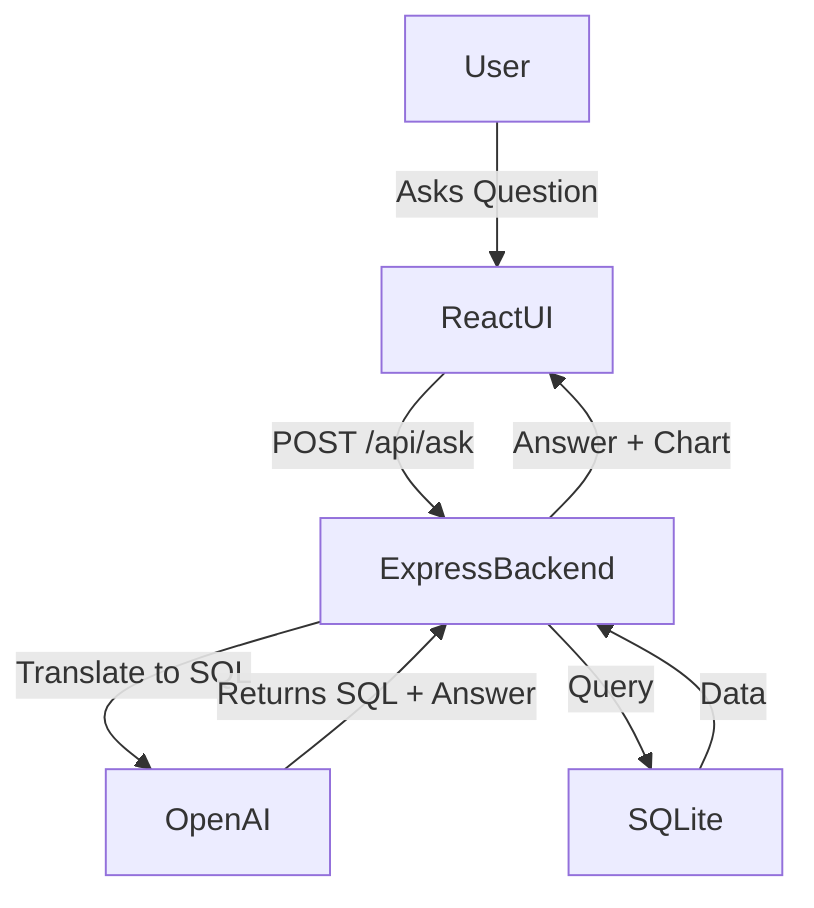

# 🧠 AI Data Agent – Internship Challenge

> A smart AI-powered conversational agent that answers complex business questions from a SQL database using natural language and auto-generated charts & tables.


---

## 📸 Demo

 <!-- Add your own screenshot in a "screenshots" folder -->

---

## 🚀 Live Demo

🌐 [View Live App](https://your-deployed-url.com)  
(Replace this with your deployed app link if available)

---

## 🛠️ Tech Stack

| Layer     | Technology                     |
|-----------|--------------------------------|
| Frontend  | React, Tailwind (or other UI)  |
| Backend   | Node.js, Express               |
| AI Agent  | OpenAI GPT (chat/completion)   |
| Database  | SQLite                         |
| Charts    | Chart.js / Recharts            |

---

## 📂 Project Structure

```

ai-data-agent/
├── ai-agent-frontend/          # React frontend (UI)
├── ai-agent-backend/           # Node + Express + SQLite + OpenAI
│   ├── db/
│   │   └── test.db             # Sample complex database
│   ├── .env                    # API key config
│   ├── index.js                # Backend server
│   └── package.json
├── README.md
└── screenshots/                # UI demo images (optional)

````

---

## 🧠 Features

- ✅ Ask vague or complex business questions
- ✅ Handles bad schema and messy table/column names
- ✅ Generates natural language answers
- ✅ Displays charts and tables
- ✅ Real-time answers using OpenAI + SQLite

---

## 💬 Example Questions It Can Answer

> These demonstrate its analytical capability beyond simple lookups.

- “Total transactions in May 2024?”
- “Show monthly revenue trend for the last year.”
- “Which customer segments had the highest churn?”
- “Compare profits between Q1 and Q2.”
- “List top 5 products by average order value.”

---

## 📦 Installation & Running Locally

### 1. Clone the repository

```bash
git clone https://github.com/yourusername/ai-data-agent.git
cd ai-data-agent
````

### 2. Backend Setup

```bash
cd ai-agent-backend
npm install
```

Create a `.env` file in `ai-agent-backend`:

```env
OPENAI_API_KEY=sk-xxxxxxxxxxxxxxxxxxxxxxxx
```

Make sure the database file exists at `ai-agent-backend/db/test.db`.

Run the backend:

```bash
node index.js
```

### 3. Frontend Setup

```bash
cd ../ai-agent-frontend
npm install
npm start
```

---

## 🔐 Environment Variables

In `ai-agent-backend/.env`:

```env
OPENAI_API_KEY=your-openai-api-key
```

---

## 🧠 Architecture Overview



---

## 🏁 Final Deliverables

* ✅ Working full-stack web app
* ✅ Complex sample SQLite database
* ✅ Conversational AI Agent with accurate responses
* ✅ Charts and tables visualization
* ✅ Production-ready README

---

## 🧑‍💻 Author

Mahboob Alam
📧 [ma.mahboob2002@gmail.com](mailto:ma.mahboob2002@gmail.com)
🔗 [LinkedIn](https://www.linkedin.com/in/mahboob-alam-242342152/)

---

## 🌟 Star the Repo

If you found this useful, consider giving it a ⭐️ on GitHub. It really helps!
